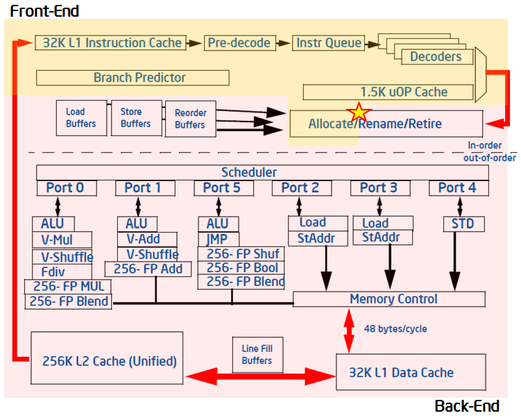

# History of Side Channel Attacks

Slides

---


## Simple Timing Attacks

When programs operate on secret data, a hostile process on the same CPU has many possibilities to observe it. It can measure timings, core utilization, memory access patterns, etc.

Example

```
static const char* secret = "the password"

bool check_pass(const char* input) {
  for (int i = 0; i < strlen(secret); ++i)
    if (secret[i] != input[i])
      return false;
  }
  return true;
}

```

This example is [not made up](https://rdist.root.org/2009/05/28/timing-attack-in-google-keyczar-library/).

Mitigation: Don't branch on secret values.

---

## Cache Based Timing Attack: Flush + Reload


* L3 cache is "transparently" shared among cores.
* L3 is inclusive: evicting data from L3 implies evicting data from L1 and L2.
* A cache hit is always faster than fetching the value from the memory. (L1 ~ 44 cycles, Memory > 200 cycles)
* X86 `clflush` instruction evicts a memory line from all caches.


### Sample Probing Method
```
t1 = counter(); 
a = *adrs;
t2 = counter();
clflush(adrs);
res = (t2-t1) < threshold;
```
In RSA, a sequence of hit/misses translates to a sequence of operations, and consequently to a sequence of bits.
### Benefits
* Targeting specific cache lines leads to a more effective attack.
* Minimal required assumptions about the running processes since LLC is shared by multiple processors.

---

# Microarchitecture Attacks

---

### Instruction Reordering

Instructions can be reordered, as long as data dependencies are observed.

```

int a  = 4;         mov rax, 4       // store to rax
int b  = *y;        mov rdx, [rsi]   // load from address in rdx
    a += 4;         add rax, 4       // add 4 to rax, only depends on instruction 1

```

---

### Two tier CPU architecture

Traditionally CPUs would have to wait when registers where reused.

```

int a  = *x;        mov rax, [rdi]    // load into rax
    a += 4;         add rax, 4        // use the value
    a  = 4;         mov rax, 4        // override rax    <- stall?

```

Nowadays:

* Externally visible registers rax, rdx, rbx, ...
* Internally: register file, dynamic register allocation

---

### Speculative Execution

But what if controlflow depends on data?

```

if (*a != 0) {              mov rax, [rax]
                            test rax
                            jz 0xb

  b += 4                    mov rdx, 4
}
b += 4                      add rdx, 4
...
// up to 200 instructions
...

```

---

### Speculative Execution

* Branch predictor predicts a branch target.
* Execution speculatively follows that branch.
* Test result becomes available.
* Speculatively executed trace is either retired or rolled back.
* Rolling back entails e.g. restoring registers, discarding memory stores in the store buffer, etc.

---



---

The core idea of spectre/meltdown: Establish a covert channel between speculatively executed instructions and actually executed instruction.


(graph from J. Horn, RealWorldCrypto '18)

---

### Problems Ahead

Speculatively executed instructions can get around security checks.

```
function use_secret():
  if (!allowed)
    throw_error();
  return public_array[secret];


// Attacker:
try:
  use_secret()
catch:
  secret = flush+reload(public_array);
```

---


# Spectre/Meltdown

---

## Rough classification

* Meltdown: Speculative memory loads allow execution of transient instructions *after* a segv.
* Spectre 1: Branch predictor allows transient execution of the wrong branch.
* Spectre 2: Poisoning the Branch Target Buffer allows transient execution of (more or less) arbitrary code.

---

### Meltdown

* Takes advantage of the [virtual memory pagination](http://www.plantation-productions.com/Webster/www.artofasm.com/Linux/HTML/MemoryArchitecturea3.html).
* The address space of a process is mapped to virtual pages. This mapping is stored in the Memory Management Unit (MMU)
* Each process can have its own virtual memory, which means different mappings and different page tables.
* When switching processes, the OS swaps the page tables in the MMU. This is an expensive operation.
* A very frequent switching is between the user process and the kernel process (e.g. `syscalls`).
  * It would be very expensive to swap tables every syscall. Thus, a common optimization is to not have the kernel address space mapped into every processe's address space.
  * Of course, the kernel page accesses are protected. However...

---

... We have seen that we can force speculative loads of information, and measure them before exceptions cancel the architectural effects.

Example:

```
1:   static int measure[255];
2:   int* kernel_secret; // pointer into (unaccessible) kernel memory space
3:   measure[*kernel_secret_pointer % 255];

4:   void sighandler() {
5:     for (int i = 0; i < 255; ++i)
6:       if (is_in_cache(measure[i])) printf("secret byte is %d", i);
7:   }
```
Line 3 will generate a segv, since we try to access protected memory. But the load was speculatively performed. By measuring timings for loads from `measure` (in the signal handler) we can recover one byte of kernel memory.

* Affects: Kernels running on Intel CPUs
* Mitigation: [Page Table Isolation](https://lwn.net/Articles/741878/)

---

### Spectre v1: Bounds Check Bypass

Exploiting code a target process, to execute mispredicted branches.

```
static uint8_t offsets = {1,2,3}

function read(char* v, unsigned o) {
  if (o < 3) {
    uint8_t i = offsets[o];
    return v[i];
  }
}
```

```
// Attacker:
uint8_t measure[255];
read(measure, secret_ptr - &offsets);
uint8_t secret = get_index_in_cache(measure);
```

* Affects: Programs branching on user input
* Examples: Kernel, JIT, Parser, De-/Serializer, ...
* Mitigation: Masking, Branchless code, ..., Microcode update

---

### Spectre v2: Branch Target Injection

Poison the branch predictor for indirect branches. Requires exact knowledge of the branch predictor on a particular architecture. Allows attacking context to seed the predictor such that in `jmp *f` the speculation for the value of `*f` is attacker controlled, thus allowing arbitrary transient code execution.

```
static void* x = &bar;
void fun() {
  asm("jmp *%1", r(x));
}
```

```
// Attacker:
poison_branch_predictor_with(&some_code_i_want_to_run);
fun();
measure();
```

* Affects: Programs using indirect jumps
* Examples: Hypervisors, Threaded code, Jump tables, ...
* Mitigation: Retpoline, Microcode update

(This is not exactly how it works. Need to combine with ideas of [return oriented programming](http://cseweb.ucsd.edu/~hovav/talks/blackhat08.html))

---

# Mitigation

## Band Aids

---

### Retpoline

[Retpoline](https://web.archive.org/web/20180117150153/https://support.google.com/faqs/answer/7625886) removes need for indirect branches.

```
jmp *rax                        call inb
                          loop: jmp loop           ; trap speculative execution
                          inb:  mov [rsp], rax     ; override return address
                                ret                ; jmp to rax
```
---

### Array Masking

```
if (i < array_size)
    int res = array[i & STATIC_UPPER_BOUND]
```

The array access translates to

```
* (&array + (i & STATIC_UPPER_BOUND)*sizeof(int))
```

Even if it is (wrongly) speculated that `i < array_size`, we limit the attacker readable memory to:

```
array[0] ... array[STATIC_UPPER_BOUND]
```

---

* [Webkit](https://webkit.org/blog/8048/what-spectre-and-meltdown-mean-for-webkit/) array index masking and pointer poisoning.
* [Firefox](https://blog.mozilla.org/security/2018/01/03/mitigations-landing-new-class-timing-attack/) disable SharedArrayBuffer and lower timer precision.
* [Chromium](https://github.com/v8/v8/wiki/Untrusted-code-mitigations)
* [Edge](https://blogs.windows.com/msedgedev/2018/01/03/speculative-execution-mitigations-microsoft-edge-internet-explorer/)
* [Linux](http://kroah.com/log/blog/2018/01/19/meltdown-status-2/)
* "[...] Intel engineers indicated that the definition of `lfence` will be revised to specify that it blocks speculative execution" [Spectre, Kocher etal., '19]
* "End users and systems administrators should check with their operating system vendors and system manufacturers, and apply any updates as soon as they are available" [intel](https://web.archive.org/web/20180119041316/https://www.intel.com/content/www/us/en/architecture-and-technology/facts-about-side-channel-analysis-and-intel-products.html)
* "The latest microcode_ctl and linux-firmware packages from Red Hat do not include resolutions to the CVE-2017-5715 (variant 2) exploit. Red Hat is no longer providing microcode to address Spectre, variant 2, due to instabilities introduced that are causing customer systems to not boot. [...] Customers are advised to contact their silicon vendor to get the latest microcode for their particular processor." [redhat](https://web.archive.org/web/20180119205832/https://access.redhat.com/solutions/3315431?sc_cid=701f2000000tsLNAAY&)
* As a curiosity, Raspberry Pis are [not vulnerable](https://www.raspberrypi.org/blog/why-raspberry-pi-isnt-vulnerable-to-spectre-or-meltdown/)
* Open Hardware?
