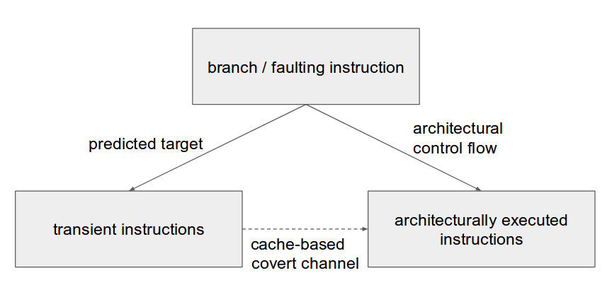

# History of Side Channel Attacks

What is a side channel?

## CPU Side Channels

Inspecting other processes through measuring shared resources.

### Timing Based

When programs operate on secret data, a hostile process on the same CPU has many possibilities to observe it. It can measure timings, core utilization, memory access patterns, etc.

Example

```
static const char* secret = "the password"

bool check_pass(const char* input) {
  for (int i = 0; i < strlen(secret); ++i)
    if (secret[i] != input[i])
      return false;
  }
  return true;
}

```

This example is [not made up](https://rdist.root.org/2009/05/28/timing-attack-in-google-keyczar-library/).

Mitigation: Don't branch on secret values.

### Cache Based

```
static uint8_t secret = 42;

int not_telling_you_anything(int* guesses) {
    return guesses[secret];
}
```


L3 cache is "transparently" shared among cores.
A cached load is much faster than getting the value from memory.

# Microarchitecture Attacks

A CPU has different kinds of resources. Pipelines are used to execute multiple instructions in parallel.


---

More generally, instructions can be reordered, as long as data dependencies are observed.

```
int a = *x;        mov rax, [rdi]   // load from address in rax
int b = *y;        mov rdx, [rsi]   // load from address in rdx
    a += 4;        add rax, 4       // add 4 to rax, only depends on instruction 1
```

---

Traditionally CPUs would have to wait when registers where reused.

```
int a = *x;        mov rax, [rdi]   // load into rax
   *x = a;         mov [rdi], rax   // read from rax
    a = y;         mov rax, rsi     // override rax    <- stall
```

But nowadays registers are allocated by the CPU on the fly. On the architectural level we still have rax, rdx, rbx, .... But internally they are mapped to any register.


But what if controlflow depends on data?

```
if (*a != 0) {     mov rax, [rax]
                   test rax
                   jz 0xb

  b += 4           mov rdx, 4
}
b += 4             add rdx, 4
...
// up to 200 instructions
...
```

* Branch predictor predicts a branch target.
* Execution speculatively follows that branch.
* Test result becomes available.
* Speculatively executed trace is either retired or rolled back.
* Rolling back entails e.g. restoring registers, discarding memory stores in the store buffer, etc.

But microarchitectural changes to the CPU stay visible!

The core idea of spectre/meltdown: Establish a covert channel between speculatively executed instructions and actually executed instruction.


(graph from J. Horn, RealWorldCrypto '18)

Why? Because speculatively executed instructions can get around security checks.

```
try:
  int secret = *secret_ptr;    // <--- segfault, since not allowed to access secret
  public_array[a];             // <--- transient execution
catch:
  int secret = flush+reload(public_array);
```

# Spectre/Meltdown

## Rough classification

* Meltdown: Speculative memory loads allow execution of transient instructions *after* a segv.
* Spectre 1: Branch predictor allows transient execution of the wrong branch.
* Spectre 2: Poisoning the Branch Target Buffer allows transient execution of (more or less) arbitrary code.

### Meltdown

Only affects Intel CPUs.

[Virtual memory](http://www.plantation-productions.com/Webster/www.artofasm.com/Linux/HTML/MemoryArchitecturea3.html) is organized in pages. A page is a continuous region of virtual address space and can be backed by physical memory. Page information is stored in the OS in a tree like structure, called page table tree.
A page has ACL bits, for example it can be Readable, Writeable, Executable. Pages can also be protected, eg. only accessible to the OS or the sanbox implementation.

Normally every process in a system has it's own virtual memory. When switching between processes the OS loads a different page table to the Memory Management Unit (MMU). However the OS internal memory is traditionally mapped into the process address space, but marked protected. This is to avoid switching the page table (which is expensive) on syscalls.

Translating a virtual memory address to a physical one requires several steps and the loading of several page table entries from memory. For perfomance ther is a Translation Lookaside Buffer (TLB) that remembers recently used mappings. If the page table entry is evicted from memory, but the actual mapping is in the TLB, intel CPUs perform a speculative load, even though it is not possible to check the protection bits yet.

Example:

```
1:   static int measure[255];
2:   int* kernel_secret; // pointer into (unaccessible) kernel memory space
3:   measure[*kernel_secret_pointer % 255];

4:   void sighandler() {
5:     for (int i = 0; i < 255; ++i)
6:       if (is_in_cache(measure[i])) printf("secret byte is %d", i);
7:   }
```
Line 3 will generate a segv, since we try to access protected memory. But the load was speculatively performed. By measuring timings for loads from `measure` (in the signal handler) we can recover one byte of kernel memory.

* Affects: Kernels
* Mitigation: [Page Table Isolation](https://lwn.net/Articles/741878/)

### Meltdown v1: Bounds Check Bypass

Exploiting code gadgets in a target process, to execute mispredicted branches. Affects programs operating on untrusted programs or data.

```
static int offsets = {1,2,3}

function read(vector<int> v2, unsigned offset) {
  if (offset < 3) {
    int i = offsets[offset];
    return v2[i];
  }
}

// Attacker:
vector<int> measure(MAX_INT);
read(measure, 0x1234 - &offsets);
int secret = get_index_in_cache(measure);  // value at 0x1234
```

* Affects: Programs branching on user input
* Examples: Kernel, JIT, Parser, De-/Serializer, ...
* Mitigation: Masking, Branchless code, ..., Microcode update

### Meltdown v2: Branch Target Injection

Poison the branch predictor for indirect branches. Requires exact knowledge of the branch predictor on a particular architecture. Allows attacking context to seed the predictor such that in `jmp *f` the speculation for the value of `*f` is attacker controlled, thus allowing arbitrary transient code execution.

```
// Vulnerable Program
static void* x = 0x1234;

void fun() {
  asm("jmp *%1", r(x));
}
```
```
// Attacker:
int some_code_i_want_to_run = {0x66, ...};
poison_branch_predictor_with(&some_code_i_want_to_run);
fun();
measure();
```

Well this is not exactly how it works. The array `some_code_i_want_to_run` is in attacker memory space, so the attacked process will not be able to access (or speculatively execute) it. To make it work, we need to combine with ideas of [return oriented programming](http://cseweb.ucsd.edu/~hovav/talks/blackhat08.html) to execute a sequence of instruction compromised only of instructions already present in the attacked program.

* Affects: Programs using indirect jumps
* Examples: Hypervisors, Interpreters using threaded code, Code generated by compilers using jump tables, ...
* Mitigation: Retpoline, Microcode update

### Meltdown vn

Probably more ways to trigger speculation exist and probably more side-channels to exfiltrate data too.

## Mitigation

* [Retpoline](https://web.archive.org/web/20180117150153/https://support.google.com/faqs/answer/7625886) removes need for indirect branches.
* [Webkit](https://webkit.org/blog/8048/what-spectre-and-meltdown-mean-for-webkit/) array index masking and pointer poisoning.
* [Firefox](https://blog.mozilla.org/security/2018/01/03/mitigations-landing-new-class-timing-attack/) disable SharedArrayBuffer and lower timer precision.
* [Chromium](https://github.com/v8/v8/wiki/Untrusted-code-mitigations)
* [Edge](https://blogs.windows.com/msedgedev/2018/01/03/speculative-execution-mitigations-microsoft-edge-internet-explorer/)
* [Linux](http://kroah.com/log/blog/2018/01/19/meltdown-status-2/)
* "[...] Intel engineers indicated that the definition of `lfence` will be revised to specify that it blocks speculative execution" [Spectre, Kocher etal., '19]
* "End users and systems administrators should check with their operating system vendors and system manufacturers, and apply any updates as soon as they are available" [intel](https://web.archive.org/web/20180119041316/https://www.intel.com/content/www/us/en/architecture-and-technology/facts-about-side-channel-analysis-and-intel-products.html)
* "The latest microcode_ctl and linux-firmware packages from Red Hat do not include resolutions to the CVE-2017-5715 (variant 2) exploit. Red Hat is no longer providing microcode to address Spectre, variant 2, due to instabilities introduced that are causing customer systems to not boot. [...] Customers are advised to contact their silicon vendor to get the latest microcode for their particular processor." [redhat](https://web.archive.org/web/20180119205832/https://access.redhat.com/solutions/3315431?sc_cid=701f2000000tsLNAAY&)
* As a curiosity, Raspberry Pis are [not vulnerable](https://www.raspberrypi.org/blog/why-raspberry-pi-isnt-vulnerable-to-spectre-or-meltdown/)
* Open Hardware?
